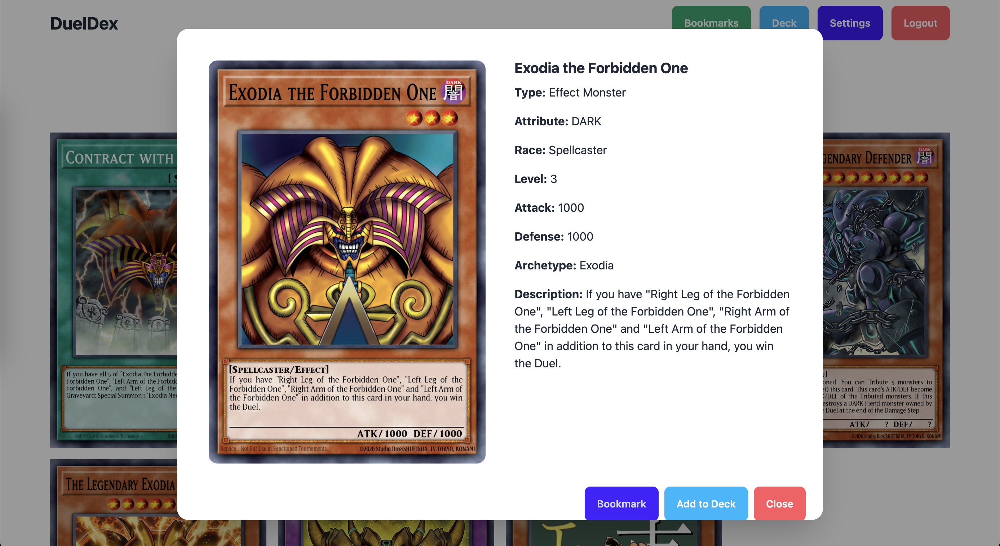

# DuelDex

DuelDex is designed to help duelists discover new cards and build stronger decks.

## Page Previews

### Search

  

### Card Details

  

## Technologies Used

- **Frontend:** React.js with Vite
- **Styling:** Tailwind CSS and DaisyUI
- **API:** YGOPRODeck API for fetching Yu-Gi-Oh! card data

## Acknowledgments

Special thanks to [YGOPRODeck](https://ygoprodeck.com/) for providing the extensive Yu-Gi-Oh! card database and API.
