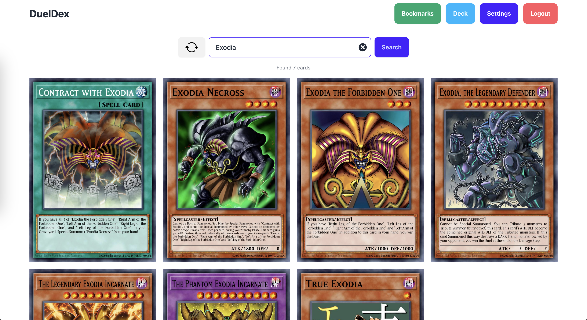

# DuelDex

[](https://github.com/aarontorres0/DuelDex/actions/workflows/deploy.yml)

[DuelDex](https://aarontorres0.github.io/DuelDex/) is designed to help duelists discover new cards and build stronger decks.

## Previews

### Search

<div align="center">
  
</div>

### Card Details

<div align="center">
  
</div>

## Setting Up Supabase

To set up Supabase in this project, follow these steps:

1. **Create a new project:**

   - Go to your [Projects](https://supabase.com/dashboard/projects).
   - Click on `New project` and follow the setup instructions.

1. **Add Project Configuration:**

   In your project's root directory, create a `.env` file and add the following with your project's credentials:

   ```
   VITE_SUPABASE_URL:YOUR_PROJECT_URL
   VITE_SUPABASE_ANON_KEY:YOUR_PROJECT_API_KEY
   ```

## Technologies Used

- **Frontend:** React.js with Vite
- **Styling:** Tailwind CSS and DaisyUI
- **API:** YGOPRODeck API
- **Authentication and Database:** Supabase

## Acknowledgments

Special thanks to [YGOPRODeck](https://ygoprodeck.com/) for providing the extensive Yu-Gi-Oh! card database and API.
